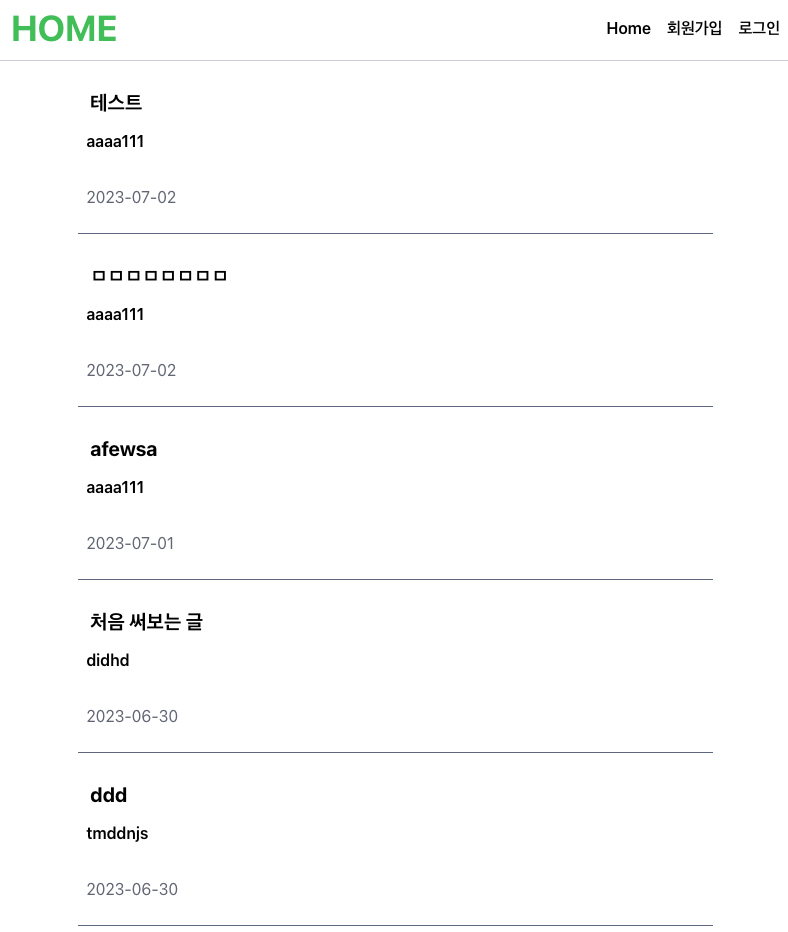

## 블로그 뉴스피드 프로젝트



> front : https://github.com/jangdu/newsFeed_front

## DB 설계


## API 설계

https://peridot-mascara-3b2.notion.site/8b8ccc5788924232be2d10ea4cd1d0a1?v=1252fc47ef3f4d959d0d4ceda894da34&pvs=4

## 설치 및 실행

### installation

```
> git clone git@github.com:jangdu/newFeed_project.git
> cd newsFeed_project
```

### backend

```
> npm install
> npm run start
```

### frontend

```
> cd frontend
> npm install
> npm run start
```

## git commit message

- feat: 기능 추가
- docs: readme같은 파일 수정
- fix: 버그 수정
- REFACTOR: 코드 리펙토링
